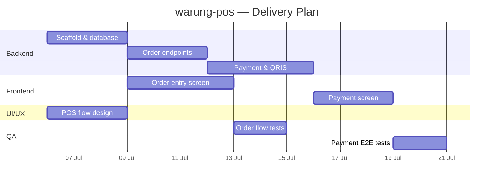

<!-- GENERATED from docs/core/ on 2026-07-02 by devpilot — do not hand-edit.
     Regenerate with /devpilot docs gantt. -->
# Project Timeline — warung-pos

> Generated 2026-07-02 from docs/core/. Durations derive from mandays in
> features.md and phase order in phases.md. Estimates, not commitments.

## Assumptions

| Assumption | Value |
|---|---|
| Working days | Mon–Fri |
| Team size per division | 1 person each |
| Start date | 2026-07-06 |

## Gantt chart

## Milestones

| Milestone | Target | Depends on |
|---|---|---|
| Orders live (internal) | 2026-07-15 | Phase 2 |
| MVP ready | 2026-07-22 | Phase 3 |
