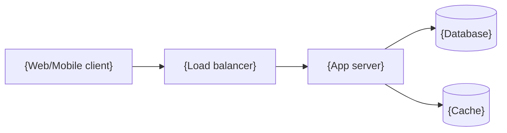

# Architecture

## System diagram

## Components

| Component | Responsibility | Ideal spec |
|---|---|---|
| {App server} | {…} | {e.g. 2 vCPU / 4 GB, autoscale 2–4} |

## Environments

| Environment | Purpose | Notes |
|---|---|---|
| development | {…} | {…} |
| staging | {…} | {…} |
| production | {…} | {…} |

## Scaling & reliability notes

- {Bottlenecks, scaling path, backup strategy.}
