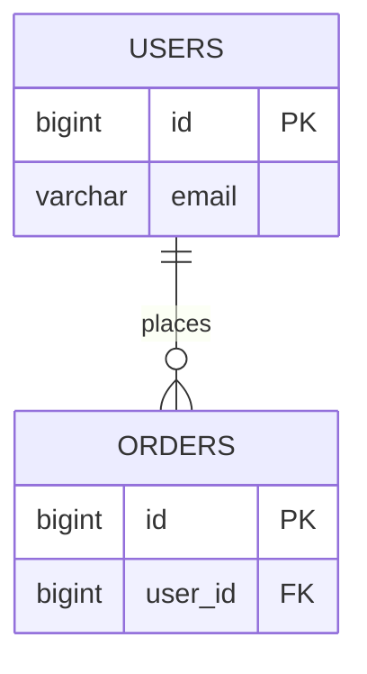

# Database Design

## ERD

## Tables

### {table_name}

| Column | Type | Constraints | Notes |
|---|---|---|---|
| id | {bigint} | PK | |
| {…} | {…} | {…} | {…} |

## Migration log

<!-- Append-only. Every schema change gets a row, linked to the feature/phase that caused it. -->
| Date | Change | Reason / feature | Phase |
|---|---|---|---|
| {YYYY-MM-DD} | {initial schema} | {init} | 1 |
